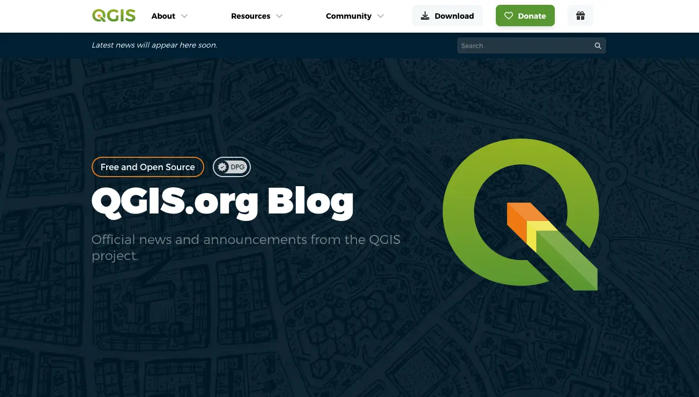

# 🌐 QGIS Blog Website [](https://blog.qgis.org/2025/02/08/qgis-recognized-as-digital-public-good/)




> ## 👋 Welcome to the QGIS Blog Website!
>
> **This repository hosts the source code for the official QGIS Blog Website:**  
> 🌍 [https://blog.qgis.org](https://blog.qgis.org)
>
> Here you'll find everything you need to **build, develop, and contribute** to the QGIS Blog Website.
>
> ### ⚠️ Note on Subdomain Websites
>
> **This repository is _only_ for the main QGIS Blog Website ([blog.qgis.org](https://blog.qgis.org)).**
>
> If you are looking for the source code or want to contribute to QGIS subdomain websites, please visit their respective repositories below.  
> Each subdomain has its own codebase and contribution process:
>
> - [plugins.qgis.org](https://plugins.qgis.org) ([GitHub: QGIS-Plugins-Website](https://github.com/qgis/QGIS-Plugins-Website)) – QGIS Plugins Repository
> - [hub.qgis.org](https://hub.qgis.org) ([GitHub: QGIS-Hub-Website](https://github.com/qgis/QGIS-Hub-Website)) – QGIS Resources Hub
> - [feed.qgis.org](https://feed.qgis.org) ([GitHub: qgis-feed](https://github.com/qgis/qgis-feed)) – QGIS Feed Manager
> - [qgis.org](https://qgis.org) ([GitHub: QGIS-Website](https://github.com/qgis/QGIS-Website)) – QGIS Main Website
> - [members.qgis.org](https://members.qgis.org) ([GitHub: QGIS-Members-Website](https://github.com/qgis/QGIS-Members-Website)) – QGIS Sustaining Members Portal
> - [certification.qgis.org](https://certification.qgis.org) ([GitHub: QGIS-Certification-Website](https://github.com/qgis/QGIS-Certification-Website)) – QGIS Certification Programme Platform
> - [changelog.qgis.org](https://changelog.qgis.org) ([GitHub: QGIS-Changelog-Website](https://github.com/qgis/QGIS-Changelog-Website)) – QGIS Changelog Manager
> - [uc2025.qgis.org](https://uc2025.qgis.org) ([GitHub: QGIS-UC-Website](https://github.com/qgis/QGIS-UC-Website)) – QGIS User Conference Website


<!-- TABLE OF CONTENTS -->
<h2 id="table-of-contents"> 📖 Table of Contents</h2>

<details open="open">
  <summary>Table of Contents</summary>
  <ol>
    <li><a href="#-project-overview"> 🚀 Project Overview </a></li>
    <li><a href="#-how-to-be-referenced"> 🌟 How to be Referenced </a></li>    <li><a href="#-writing-a-blog-post"> ✍️ Writing a Blog Post </a></li>    <li><a href="#-qa-status"> 🚥 QA Status </a></li>
    <li><a href="#-license"> 📜 License </a></li>
    <li><a href="#-folder-structure"> 📂 Folder Structure </a></li>
    <li><a href="#-using-ai-large-language-models"> 🤖 Using 'AI' (Large Language Models) </a></li>
    <li><a href="#️-scripts-overview"> 🛠️ Scripts Overview </a></li>
    <li><a href="#-using-the-nix-flake"> 🧊 Using the Nix Flake </a></li>
    <li><a href="#-contributing"> ✨ Contributing </a></li>
    <li><a href="#-have-questions"> 🙋 Have Questions? </a></li>
    <li><a href="#-contributors"> 🧑‍💻👩‍💻 Contributors </a></li>
  </ol>
</details>


## 🚀 Project Overview

The QGIS Blog Website ([blog.qgis.org](https://blog.qgis.org)) is the official blog for the QGIS project. It publishes news, release announcements, grant reports, sustaining member updates, and community stories. The site is built with [Hugo](https://gohugo.io/) and uses the [QGIS Hugo Website Theme](https://github.com/qgis/QGIS-Hugo-Website-Theme). Blog posts are written by QGIS team members and imported from the WordPress REST API.


## 🌟 How to be Referenced

The QGIS Blog is the **official QGIS project blog**, written by QGIS team members and contributors. It is not an RSS aggregator. To publish a post on the blog, see [CONTRIBUTING.md](CONTRIBUTING.md).

If you are looking to have your personal QGIS-related blog listed, please visit the [QGIS Planet](https://plugins.qgis.org/planet/) instead.


## ✍️ Writing a Blog Post

Blog posts live in `content/posts/` as Markdown files with HTML front matter. See [CONTRIBUTING.md](CONTRIBUTING.md#-writing-a-blog-post) for the full guide including images and front matter reference.


## 🚥 QA Status

### 🪪 Badges
| Badge | Description |
|-------|-------------|
| [](https://github.com/qgis/QGIS-Blog-Website/actions/workflows/playwright-e2e.yml) | End-to-end tests status (Playwright) |
| [](https://github.com/qgis/QGIS-Blog-Website/actions/workflows/github-pages.yml) | Deployment status to GitHub Pages |
|  | Website availability status |
|  | Repository license |
|  | Open issues count |
|  | Closed issues count |
|  | Open pull requests count |
|  | Closed pull requests count |

### ⭐️ Project Stars


## 📜 License

This project is licensed under the MIT License. See the [LICENSE](./LICENSE) file for details.


## 📂 Folder Structure

```plaintext
QGIS-Blog-Website/
  ├── 🖼️  assets/           # Mainly used to store the schedule.csv file
  ├── ⚙️  config/           # Hugo configuration files
  ├── 📄  content/          # Markdown content files (pages, posts)
  ├── 🗄️  data/             # Data files (JSON) for site variables (feed, languages, subscribers)
  ├── 🖼️  img/              # Images files used by this README
  ├── 🧩  layouts/          # Hugo templates and partials
  ├── 🧪  playwright/       # Playwright end-to-end test scripts
  ├── 📦  public/           # Generated site output (after `hugo` build)
  ├── 🗂️  resources/        # Hugo-generated resources (e.g., minified assets)
  ├── 🛠️  scripts/          # Utility scripts for development/maintenance/harvesting
  ├── 📄  static/           # Static files served as-is (e.g., favicon, robots.txt)
  ├── 🎨  themes/           # Hugo themes
  ├── ⚙️  config.toml       # Main Hugo configuration file
  ├── 🤝  CONTRIBUTING.md   # Contribution guidelines
  ├── 🐍  fetch_feeds.py*   # Script to get sustaining members and other feeds to update the planet website
  ├── 📜  LICENSE           # Project license
  ├── ⚙️  Makefile          # Build/Deployment automation commands
  ├── 📖  README.md         # Project overview and instructions
  ├── 📋  REQUIREMENTS.txt  # Python dependencies (pip)
  ├── 🐚  flake.nix         # Nix flake environment definition
  └── 💡  vscode.sh*        # VSCode helper script for Nix development environment
```


## 🤖 Using 'AI' (Large Language Models)

We are fine with using LLM's and Generative Machine Learning to act as general assistants, but the following three guidelines should be followed:

1. **Repeatability:** Although we understand that repeatability is not possible generally, whenever you are verbatim using LLM or Generative Machine Learning outputs in this project, you **must** also provide the prompt that you used to generate the resource.
2. **Declaration:** Sharing the prompt above is implicit declaration that a machine learning assistant was used. If it is not obvious that a piece of work was generated, include the robot (🤖) icon next to a code snippet or text snippet.
3. **Validation:** Outputs generated by a virtual assistant should always be validated by a human and you, as contributor, take ultimate responsibility for the correct functionality of any code and the correct expression in any text or media you submit to this project.


## 🛠️ Scripts Overview

The `scripts/` folder contains utility scripts to assist with data loading, and project maintenance. Below is a summary of each script:


| Script Name                       | Description                                                                                  |
|-----------------------------------|----------------------------------------------------------------------------------------------|
| `fetch_feeds.py`                  | Fetches sustaining members and other feeds to update the website                              |
| `vscode.sh`                       | Launch VSCode with all settings and extensions needed to productively work on this project    |
| `scripts/get_commit_hash.sh`  | Get the current commit hash and write it in config/commit.toml for the website version.  |
| `scripts/resize_image.py`  | Contains utilities to optimize images (resize, transform to webp, check validity).  |
| `scripts/import_wordpress.py`  | Import posts from blog.qgis.org via the WordPress.com REST API into `content/posts/`.  |

> ✏️ **Note:** Run each script from the project root. Some scripts may require environment variables or configuration—see comments within each script for usage details.


## 🧊 Using the Nix Flake

The development environment is using Nix flakes. Please visit <https://nixos.wiki/wiki/Flakes> for more details.

Start the Nix development environment by running:

```sh
nix develop # Add  --experimental-features 'nix-command flakes' if you haven't enable Nix flakes
hugo server
# If you want to run VSCode:
./vscode
```

To build the website:

```sh
nix build .#packages.x86_64-linux # Add | cachix push QGIS-Blog-Website to push it to cachix
```


## ✨ Contributing

We welcome contributions! Please read the [CONTRIBUTING.md](CONTRIBUTING.md) for guidelines on how to get started.


## 🙋 Have Questions?

Have questions or feedback? Feel free to open an issue or submit a Pull Request!  


## 🧑‍💻👩‍💻 Contributors

- [Tim Sutton](https://github.com/timlinux) – Original author and lead maintainer of the QGIS Blog Website project
- [Kontur Team](https://www.kontur.io) – Responsible for the design and development of the current website theme
- [Lova Andriarimalala](https://github.com/Xpirix) – Core developer and ongoing maintainer
- [QGIS Contributors](https://github.com/qgis/QGIS-Blog-Website/graphs/contributors) – See the full list of amazing contributors who have helped make this website possible.


Made with ❤️ by Tim Sutton (@timlinux), Lova Andriarimalala (@Xpirix) and QGIS Contributors.